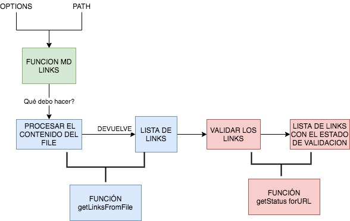

# Markdown Links
Cuarto proyecto de especialización Front End generación 16 de Laboratoria

## Plan de acción:

La implementación de este proyecto como Chore tiene 3 funciones:
>getLinksFromFile: Extrae los links de un path.

>getStatusFromUrl: Entrega el status de una URL entregada.

>mdLinks: Función que retorna una promesa que devuelve un arreglo de objetos con la información extraída en las funciones anteriormente mencionadas.

## Documentación técnica de la librería:

Dentro de los archivos index.js y cli.js algunas de las  funcionalidades o procesos en su parte superior puedes encontrar un link comentado  con  la documentación consultada.

Algunos de los links accedidos en orden  temporal según necesidad fueron:

* [Leer línea por línea un archivo](https://nodejs.org/api/readline.html#readline_example_read_file_stream_line_by_line)

* [Status for url con Fetch](/https://www.npmjs.com/package/node-fetch)

* [Tests, mocked fetch](https://jestjs.io/docs/bypassing-module-mocks)

* [CLI, hacer un archivo CLI básico ](https://medium.com/netscape/a-guide-to-create-a-nodejs-command-line-package-c2166ad0452e)

* [CLI, declarar opciones](https://www.npmjs.com/package/commander)

## Guía de uso e instalación de la librería

* Instalación:
> npm install <github-user> https://github.com/castrocami/SCL016-md-link

* Guía de uso:

> Debes entregar una opción para lectura: Un directorio (Ejemplo: ./documentation) o un markdown document (Ejemplo: README.md)

> Luego puedes ingresar las siguientes opciones:

| Opciones | Descripción |
| --- | --- |
| Opción vacía (Default) | No valida si las URLs responden ok o no, solo  identifica el archivo markdown o directorio e imprime los links que vaya encontrando, junto con la ruta del archivo donde aparece y el texto que hay dentro del link  |
| --validate | Valida si las URLs responden ok o no, imprime los links que vaya encontrando, la ruta del archivo donde aparece, texto que hay dentro del link, mensaje de ok o fail y su status |
| --stats | Muestra  un texto con estadísticas básicas sobre los links "Total" con el total de links, "Unique" con la cantidad de links únicos. |
| --validate --stats | Muestra  un texto con estadísticas básicas sobre los links: "Total" con el total de links, "Unique" con la cantidad de links únicos, "Broken" con la cantidad de links que responden fail |
